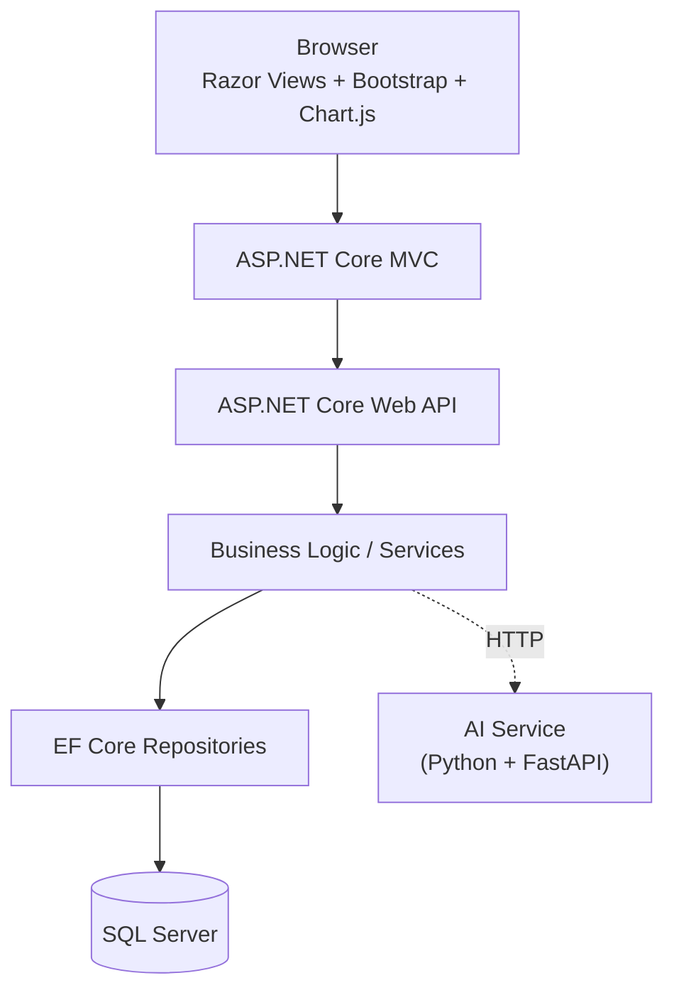
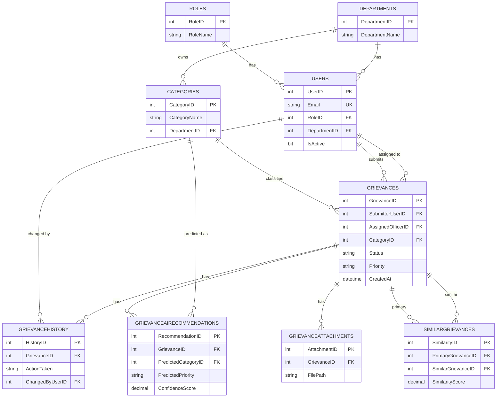
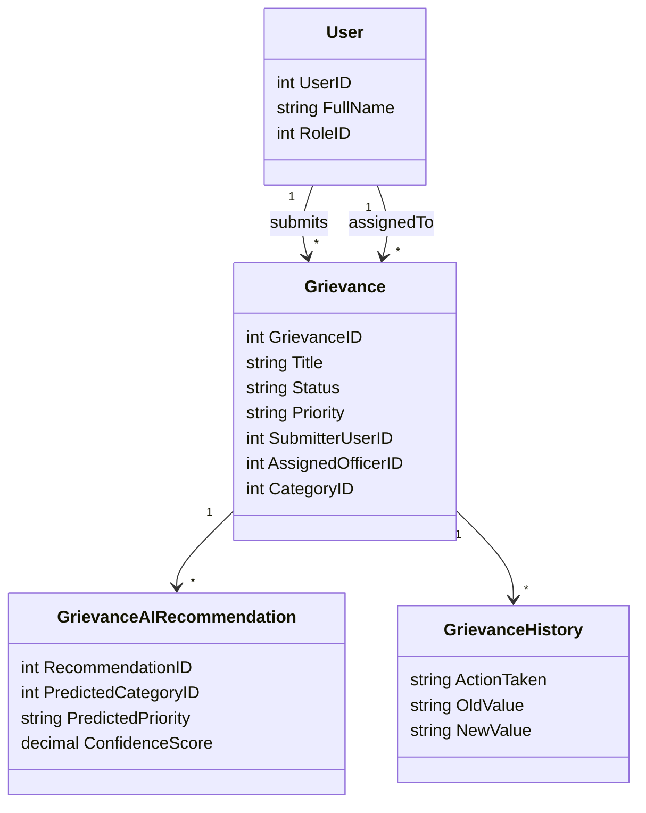
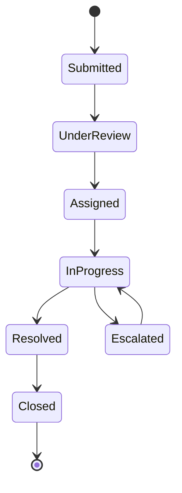
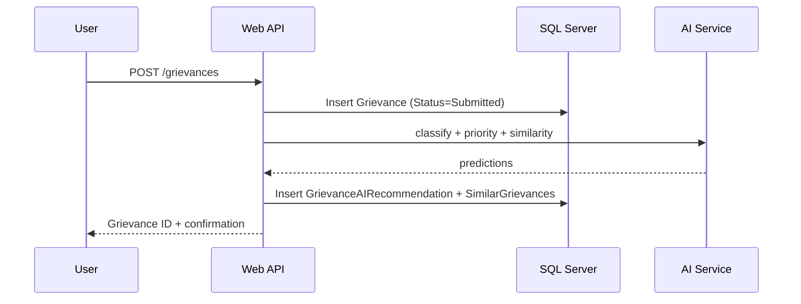
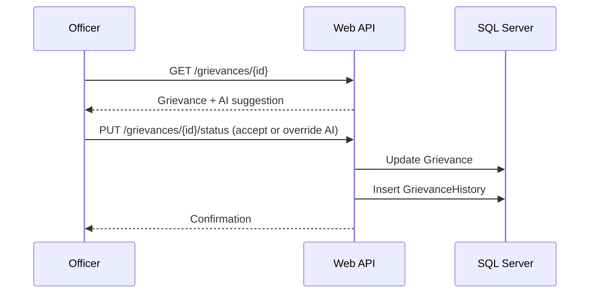
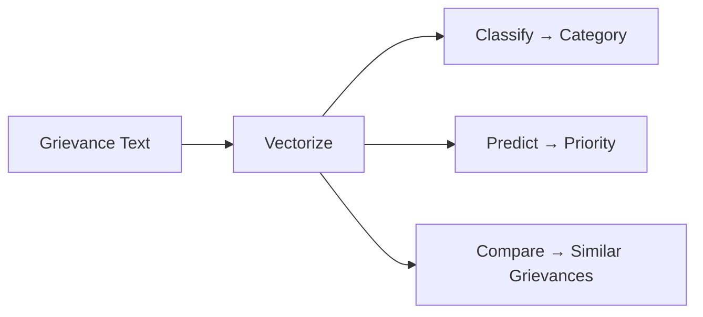
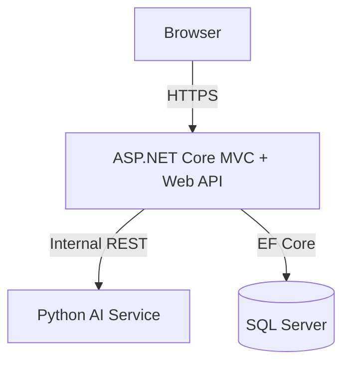

# System Design
## AI-Assisted Smart Grievance Redressal System

---

## 1. Overview

A centralized system where employees submit grievances, an AI service suggests category/priority/duplicates, and officers make the final call. Built on ASP.NET Core (MVC + Web API + EF Core) with SQL Server, plus a separate Python AI service.

---

## 2. Architecture

**Key rule:** the AI service only returns predictions. Only the .NET Business Logic layer decides what gets saved as the grievance's real `Category`/`Priority` — AI output always lands in `GrievanceAIRecommendations` first, never directly into `Grievances`.

---

## 3. Modules at a Glance

| Module | Does | Owns |
|---|---|---|
| Authentication & Authorization | Login, roles, access control | `Users`, `Roles` |
| Grievance Management | Submit, track, assign, resolve, escalate | `Grievances`, `GrievanceHistory`, `GrievanceAttachments` |
| AI-Assisted Triage | Calls AI service, stores recommendations | `GrievanceAIRecommendations`, `SimilarGrievances` |
| Administration | Manage users, departments, categories | `Users`, `Departments`, `Categories` |
| Dashboard & Reporting | Stats, trends, AI accuracy | Read-only queries across all tables |

---

## 4. Database Design (ERD)

This is exactly the schema in `SmartGrievanceDB_complete.sql` — no changes required. Two small additions to keep in mind while building:
- **Indexes**: add indexes on `Grievances.Status`, `SubmitterUserID`, `AssignedOfficerID`, `CategoryID` — these are the columns every filter/dashboard query will use.
- **Notifications**: the requirement doc mentions notifications, but there's no table for it yet. Add one simple table (`UserID`, `GrievanceID`, `Message`, `IsRead`, `CreatedAt`) when building that feature — it doesn't affect anything else.

---

## 5. Domain Model

Build one repository + service per entity group (Grievance, User, Category, etc.) — map each straight from the ERD above.

---

## 6. Grievance Lifecycle

Every arrow = one row in `GrievanceHistory`. Put this rule in **one place** (e.g. `UpdateStatusAsync`) so no other code path can change `Status` without logging it.

---

## 7. API Endpoints

| Module | Endpoint | Method | Access |
|---|---|---|---|
| Auth | `/auth/login`, `/auth/register`, `/auth/me` | POST/POST/GET | Public / Authenticated |
| Grievances | `/grievances` | POST, GET | User submits, User/Officer/Admin list |
| Grievances | `/grievances/{id}` | GET | Owner / Officer / Admin |
| Grievances | `/grievances/{id}/status` | PUT | Officer / Admin |
| Grievances | `/grievances/{id}/assign` | PUT | Officer / Admin |
| Grievances | `/grievances/{id}/history` | GET | Owner / Officer / Admin |
| Grievances | `/grievances/{id}/similar` | GET | Officer / Admin |
| Admin | `/admin/users`, `/admin/departments`, `/admin/categories` | CRUD | Admin |
| Reports | `/reports/summary`, `/reports/by-department`, `/reports/ai-accuracy` | GET | Officer / Admin |
| AI (internal only) | `/internal/ai/classify`, `/internal/ai/priority`, `/internal/ai/similarity` | POST | Called by backend only, never by the browser |

---

## 8. Key Workflows

### 8.1 Submit Grievance → AI Triage

### 8.2 Officer Reviews & Updates Status

---

## 9. AI Service Design

- Runs as its own service (FastAPI), called only by the .NET backend — never by the browser directly.
- Stateless: takes text in, returns predictions out. All saving happens on the .NET side.
- Train the model offline on the synthetic dataset, load it once at startup.
- Only compare a new grievance against others in the **same category** first — cheaper and more accurate than comparing against everything.

---

## 10. Security

- Roles (`User`, `Grievance Officer`, `Administrator`) enforced on every controller **and** re-checked in the service layer.
- Users can only see their own grievances; officers only their assigned/department ones; admins see all.
- Passwords hashed, never stored in plain text.
- All EF Core queries are parameterized by default — don't write raw SQL string concatenation.

---

## 11. Deployment

Can all run on one machine for a demo/student setup — drawn as three tiers so it scales cleanly later if needed.

